# YOLOv11 COCO Dataset Analysis with Tensorleap

This project uses the Ultralytics YOLOv11 model for object detection on the COCO dataset which contains 122k natural image samples of 80 object's classes.  
**Tensorleap** enables exploration of the dataset’s latent space, helping identify hidden patterns, mislabeled data, and unlabeled clusters efficiently.
---

## 🔍 Latent Space Exploration
Tensorleap’s Population Exploration (PE) map visualizes the model’s latent space by reducing its dimensions using t-SNE or PCA. Samples are grouped based on semantic similarity, revealing meaningful clusters that reflect how the model understands the data.
Figure 1 shows the platform’s automatically generated clusters, each marked with a different color after applying t-SNE to the model’s latent space.
Figure 2 colors the same latent space by the presence of trains, revealing that train-containing samples are concentrated in Cluster 13—demonstrating the model’s ability to group semantically similar data.
<p align="center">
  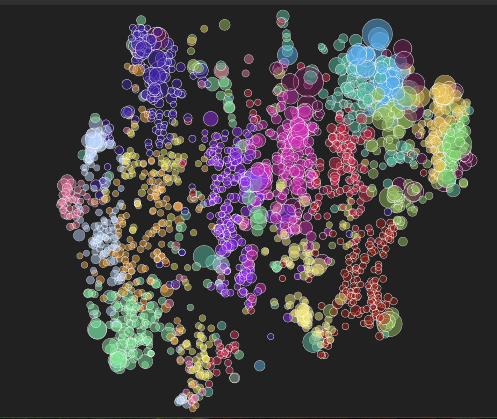
  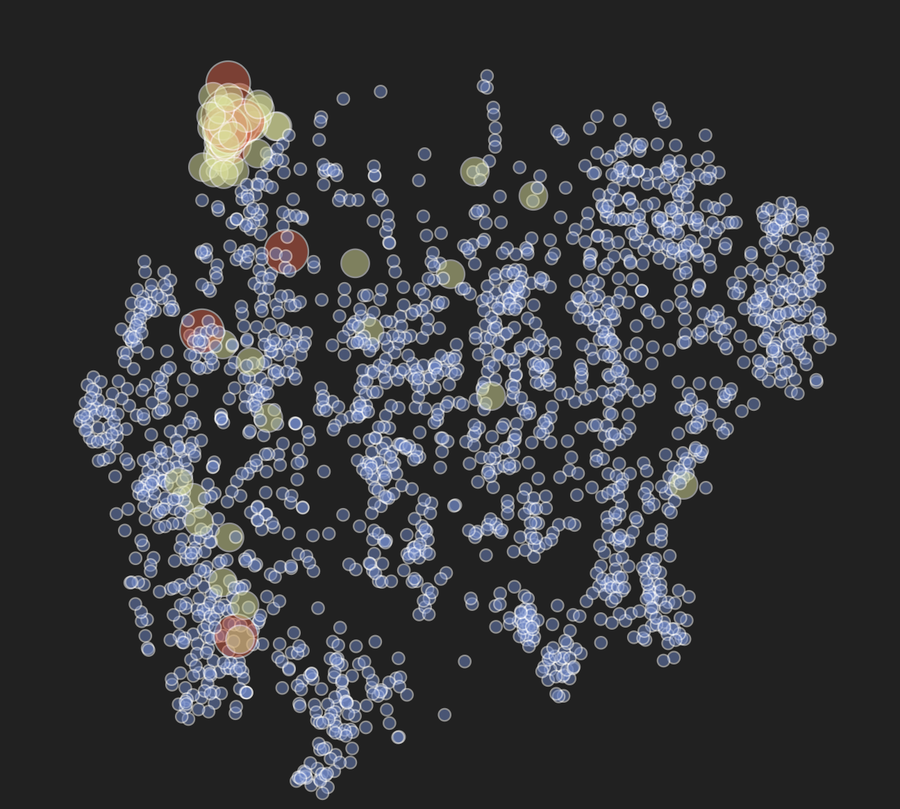
</p>

<p align="center">
  <b>Figure 1</b> – Visualization of the model latent space clustered into semantic groups  
  &nbsp;&nbsp;&nbsp;&nbsp;
  <b>Figure 2</b> – Latent space colored by concentration of trains
</p>

---
## 🔎 Platform Generated Insights

While initial patterns can be visually identified from the Population Exploration (PE) map—such as the concentration of trains in a specific cluster—our platform goes further by automatically generates insights highlighting :
- Low-performance clusters
- Overfitted regions
- Areas of over- or under-representation
- Correlations with metadata

These insights are crucial for identifying model weaknesses and guiding targeted improvements.


### 💡 Over Representation – Train Samples
One of the insights generated by the platform, based on the YOLOv11 model trained on the COCO dataset, was an over-representation insight (Figure 3). This insight was linked to the train-related cluster (Figure 2), revealing a disproportionately high number of training samples compared to very few validation samples—highlighting a potential imbalance in data distribution.
<p align="center">
  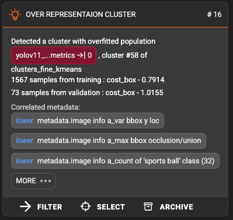
</p>

<p align="center">
  <b>Figure 3</b> – Over representation insight
</p>

 This cluster exhibits a low bounding box loss in training (0.79) and a higher loss in validation (1.01), suggesting that the training samples contribute limited new information.  Additionally, the cluster shows a strong correlation with low occlusion, indicating that it primarily contains relatively “easy” examples. Based on this insight, we hypothesize that the model overfit to these simple cases—memorizing them during training. As a result, it failed to generalize when encountering semantically similar but statistically different validation samples.

To validate this hypothesis, we visualized representative training and validation samples from within the cluster, to assess the relative difficulty and diversity of the data. 

<p align="center">
  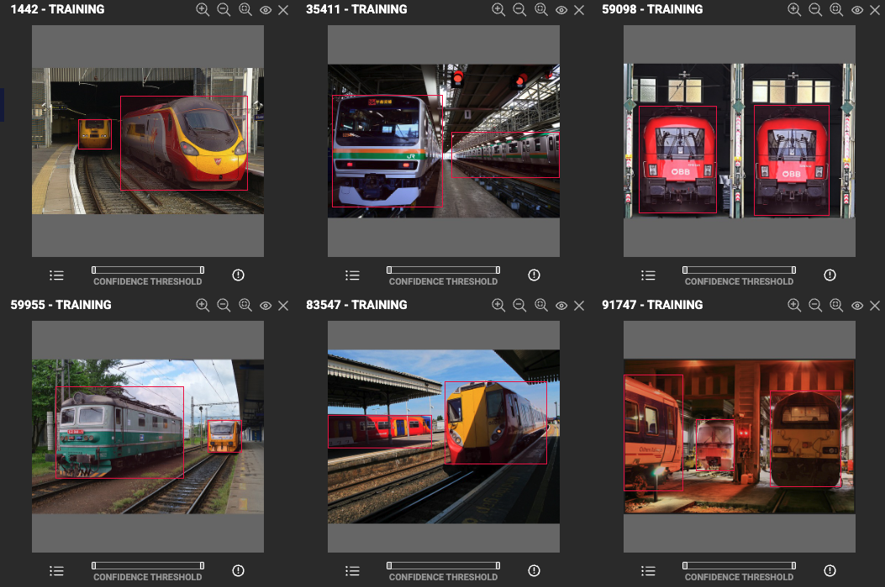
  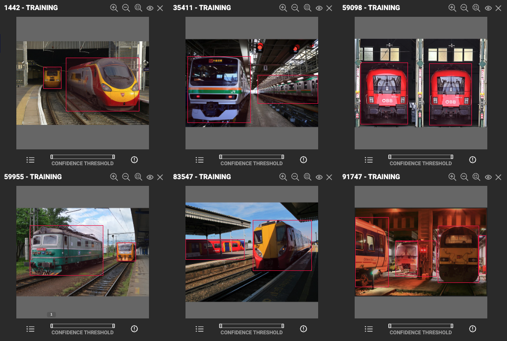
</p>

<p align="center">
  <b>Figure 4</b> – Ground truth easy samples in cluster. 
  &nbsp;&nbsp;&nbsp;&nbsp;
  <b>Figure 5</b> – predicted easy samples in cluster.
</p>

<p align="center">
  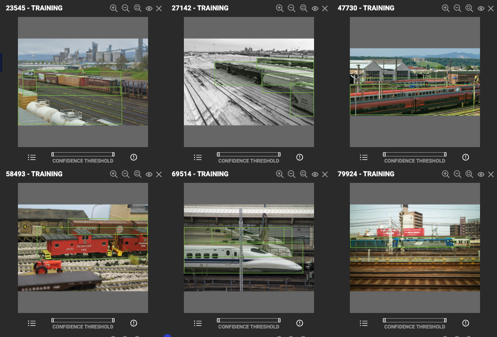
  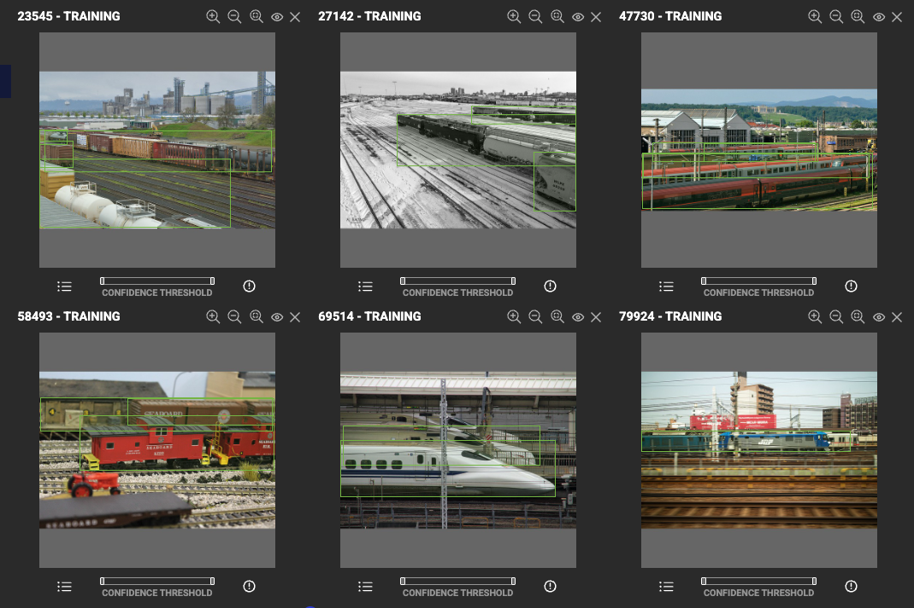
</p>

<p align="center">
  <b>Figure 6</b> – Ground truth hard val samples in cluster.  
  &nbsp;&nbsp;&nbsp;&nbsp;
  <b>Figure 7</b> – predicted hard val samples in cluster.
</p>


As can be seen, the train images within the cluster contain very minimal occlusion compared to the validation samples inside the cluster, which exhibit significant occlusion.

---


### 💡 Small Objects

Based on the feature map, the platform extracted additional insight as shown below (Figure 8). This insight indentifies a low performance cluster, and is particularly significant as it impacts a large number of samples (8,153 and 3,965, respectively) and is associated with the highest loss. Understanding and addressing the root causes of this issue can lead to substantial improvements in the model’s overall performance. Furthermore, this cluster shows strong correlations with metadata indicators of samples containing small objects—such as low mean and median bounding box sizes. Coloring the feature map of this cluster (Figure 9) by median bounding box size further supports the insight that this cluster is associated with small object characteristics.

<p align="center">
  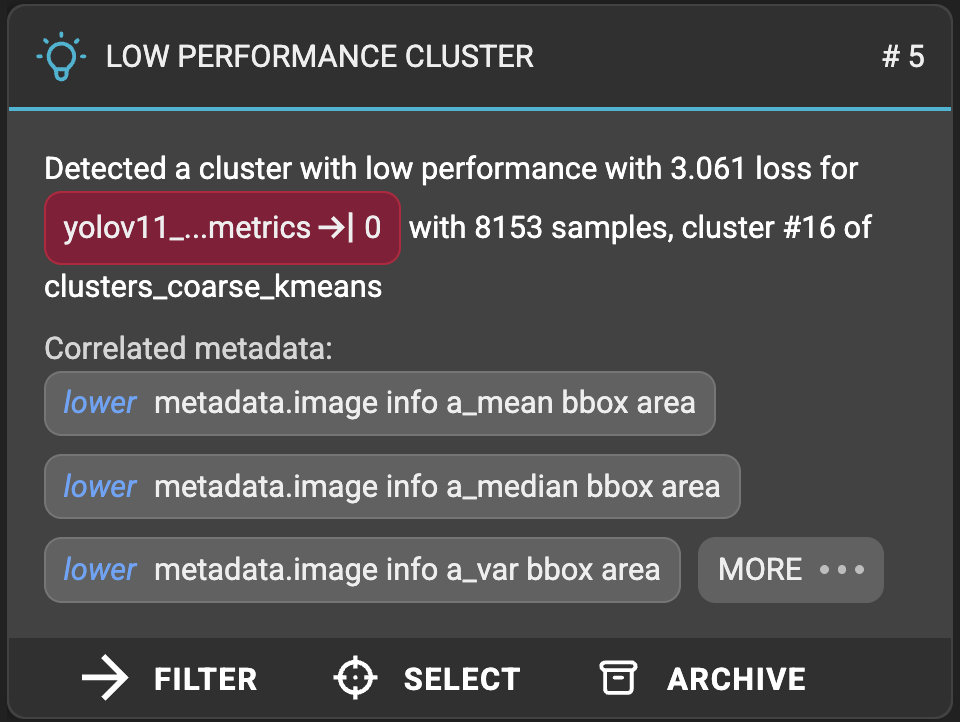
  
</p>

<p align="center">
  <b>Figure 8</b> – Small objects insight.  
  &nbsp;&nbsp;&nbsp;&nbsp;
  <b>Figure 9</b> – PE map after PCA, colored by median bounding box area, showing the selected samples from the insight.
</p>


An immediate hypothesis from this insight is that YOLOv11 struggles with detecting small objects. A quick review of sample predictions from this cluster supports this idea. As shown in Figures 10-11, while the ground truth includes many small objects (e.g., traffic lights), the model fails to detect them, identifying only the largest object in the image. Additionally, platform-generated heat map reveals that the model pays little attention to the regions containing small objects, further reinforcing this conclusion.

<div style="display: grid; grid-template-columns: repeat(5, 1fr); gap: 20px; justify-items: center; margin-top: 30px;">
  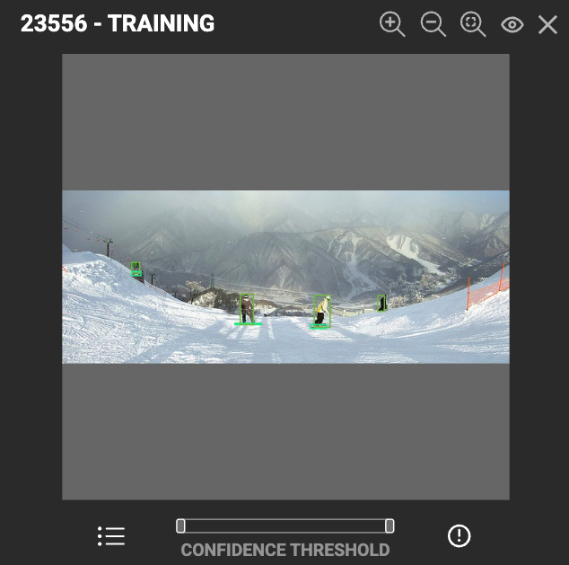
  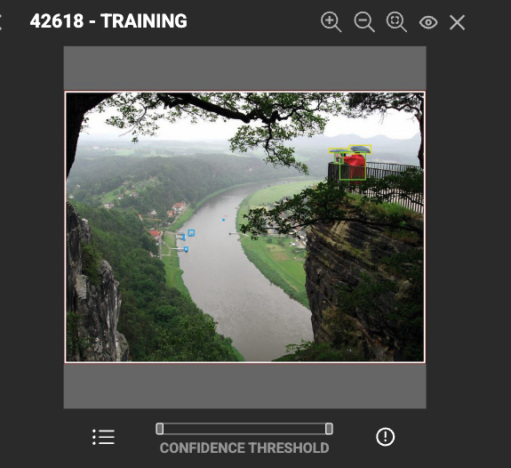
  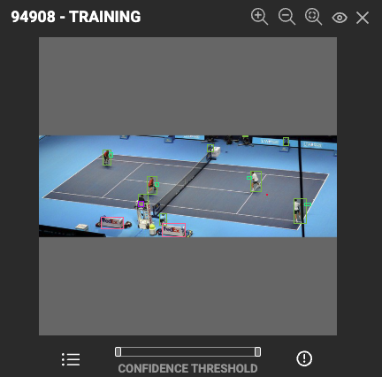
  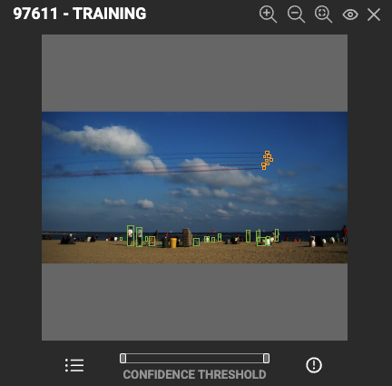
  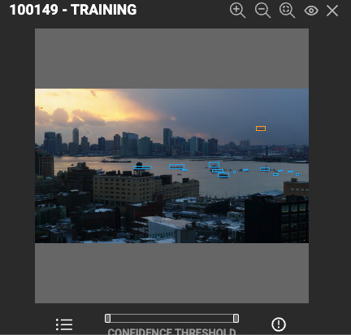
  
  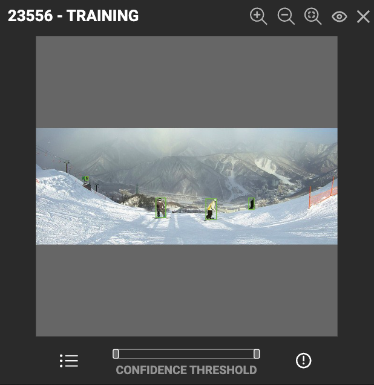
  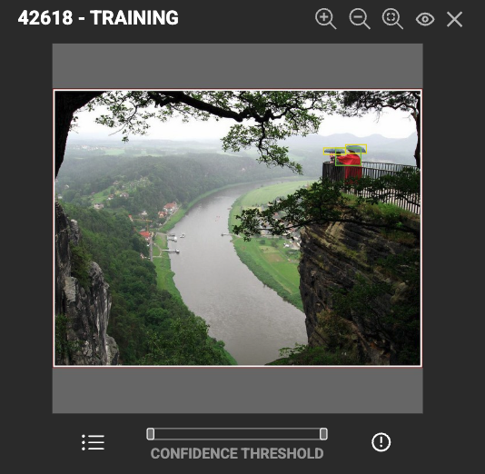
  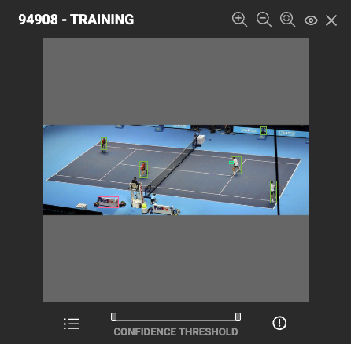
  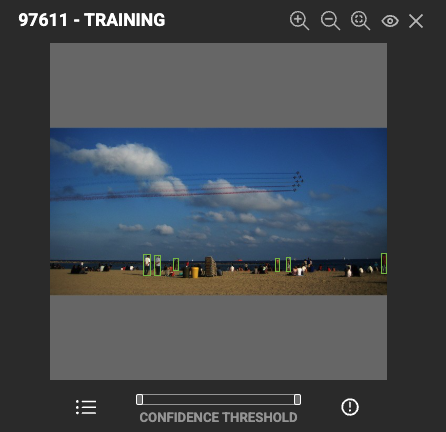
  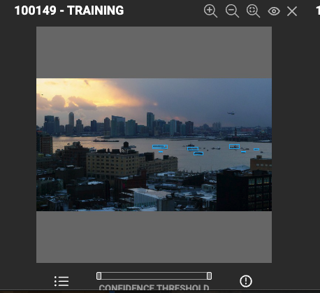
</div>

<div style="text-align: center; margin-top: 10px;">
  <b>Figure 10</b> – Representative samples from the cluster.  
  Top: Ground Truth &nbsp;&nbsp;&nbsp;&nbsp; Bottom: Predictions
</div>


<div style="display: flex; justify-content: center; gap: 20px; margin-top: 30px;">
  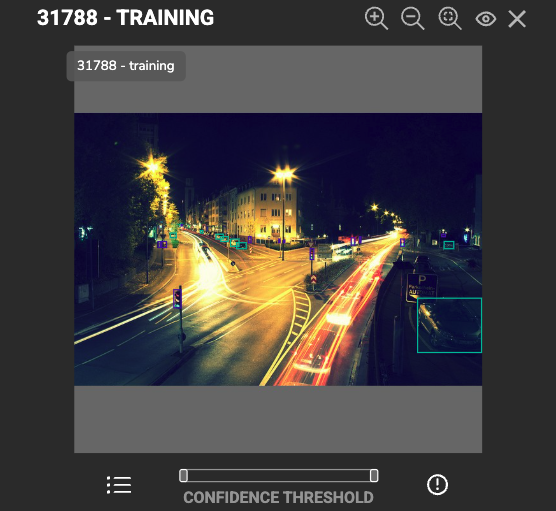
  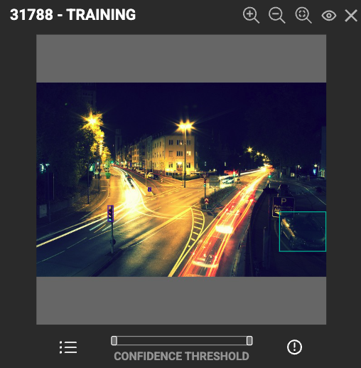
  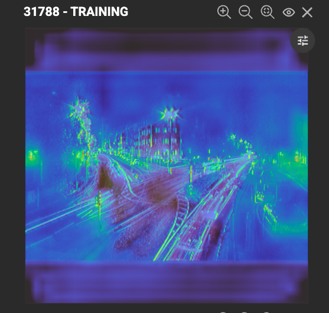
</div>

<div style="text-align: center; margin-top: 10px;">
  <b>Figure 11</b> – Example image from the cluster. From left to right: Ground truth, prediction, heatmap.
</div>

As a final validation, a line graph from the platform (Figure 12) confirms our assumption: as the median bounding box area in a sample decreases, the loss increases. This clear trend explains the poor performance observed in the two clusters and highlights the model’s difficulty in handling small objects.

<div style="text-align: center; margin-top: 20px;">
  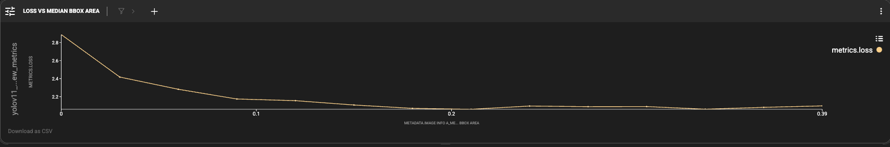<br/>
  <b>Figure 12</b> – Loss as a function of median bounding box area
</div>


 Based on this analysis, our recommendation is to adjust Ultralytics’ default loss weights to place greater emphasis on focal loss to penalize small object errors more heavily.


## 💡 Miss-labeled Books

Another valuable insight generated by the platform is shown in Figure 12. Cluster #2 contains 8,826 samples with a relatively high average loss of 2.941. To understand its semantic meaning, we colored the map based on object labels. This revealed that the cluster has a high concentration of books, as illustrated in Figure 13.

<div style="display: flex; justify-content: center; gap: 30px; margin-top: 30px;">
  <div style="text-align: center;">
    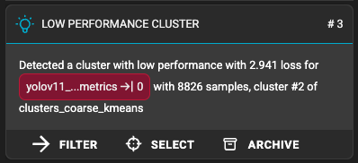<br/>
    <b>Figure 13</b>
  </div>
  <div style="text-align: center;">
    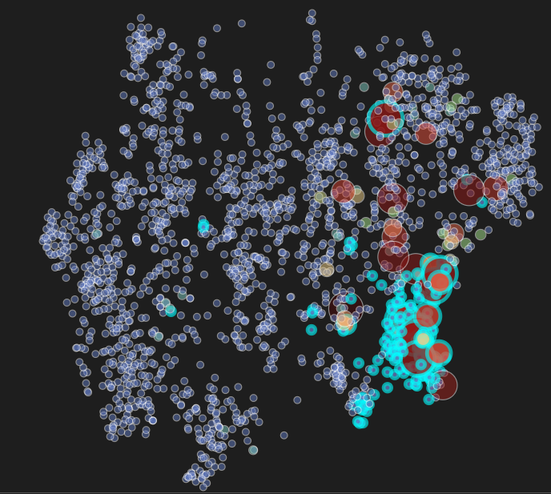<br/>
    <b>Figure 14</b> – PE map colored by books concentration (TSNE)
  </div>
</div>


Examining samples within this cluster reveals three potential books related labeling issues contributing to the poor performance:

- The books in the COCO dataset are inconsistently labeled—some are annotated while others are not, with no clear criteria for inclusion. 
- Books are sometimes labeled as individual items and other times as grouped bounding boxes, creating ambiguity. 
- Bounding boxes for rotated books tend to be imprecise, often covering surrounding objects rather than the book itself. 
Figure 15 illustrates these labeling inconsistencies.

<div style="display: grid; grid-template-columns: repeat(3, 1fr); gap: 20px; justify-items: center; margin-top: 30px;">
  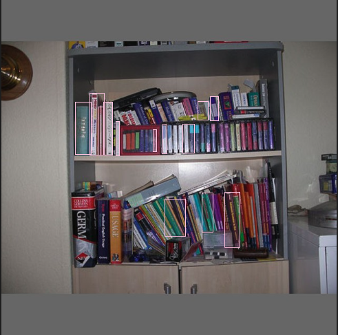
  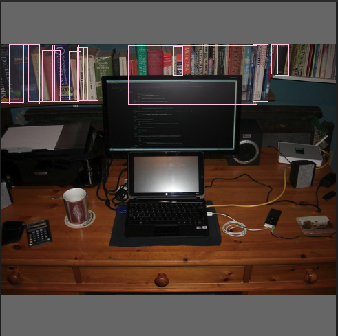
  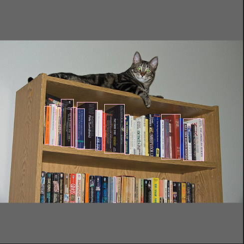
  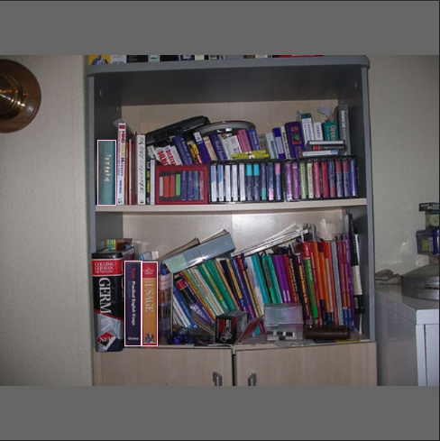
  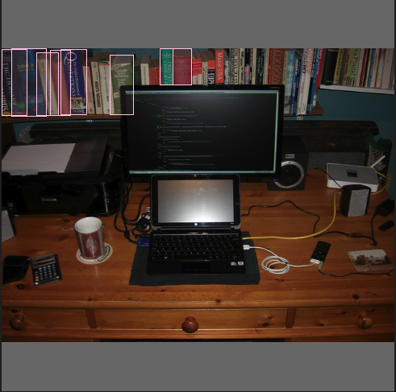
  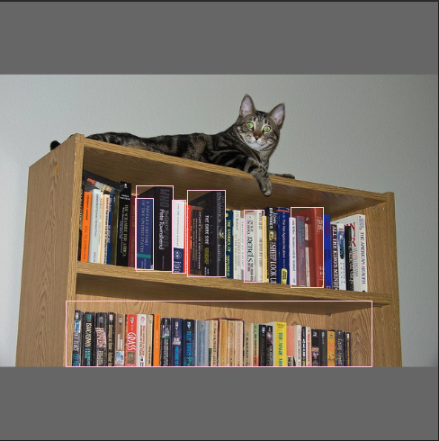
</div>

<div style="text-align: center; margin-top: 10px;">
  <b>Figure 15</b> – Representative samples from the cluster.  
  Top: Ground Truth &nbsp;&nbsp;&nbsp;&nbsp; Bottom: Predictions
</div>


As a result, the model tends to detect only a subset of the books, often identifying different ones than those annotated in the ground truth. This mismatch contributes to the elevated loss observed in the cluster . The model also struggles to distinguish between the two labeling styles—individual books versus groups—leading to frequent prediction errors and further degrading performance in this region.

These insights can be further supported by the platform’s in-depth analysis using Grad-CAM-like visualizations. In Figure 16a, the final layer of the model shows distinct focus points on four separate books on the top shelf, while the lower shelf displays a single, broad focus area—suggesting the model is treating the entire bookshelf as one object. Interestingly, by leveraging the platform’s ability to inspect intermediate layers (Figure 16b), we observed that Layer 45 correctly focuses on individual books on the lower shelf. This suggests that enhancing the influence of this intermediate layer on the final prediction could help mitigate the performance issues.

<p>
  These insights can be further supported by the platform’s in-depth analysis using Grad-CAM-like visualizations. In <b>Figure 16a</b>, the final layer of the model shows distinct focus points on four separate books on the top shelf, while the lower shelf displays a single, broad focus area—suggesting the model is treating the entire bookshelf as one object. Interestingly, by leveraging the platform’s ability to inspect intermediate layers (<b>Figure 16b</b>), we observed that Layer 45 correctly focuses on individual books on the lower shelf. This suggests that enhancing the influence of this intermediate layer on the final prediction could help mitigate the performance issues.
</p>

<div style="display: flex; justify-content: center; gap: 30px; margin-top: 30px;">
  <div style="text-align: center;">
    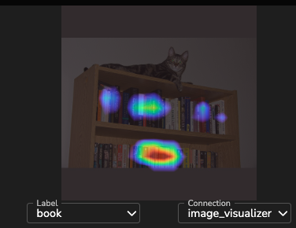<br/>
    <b>Figure 16a</b> – Final layer: Focus on grouped books (bottom) and individual books (top)
  </div>
  <div style="text-align: center;">
    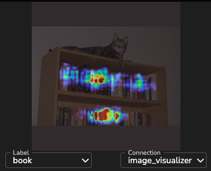<br/>
    <b>Figure 16b</b> – Intermediate layer (Layer 45): Focus on individual books across shelves
  </div>
</div>


To support the hypothesis that inconsistent book labeling significantly impacts the cluster’s poor performance, we generated a graph of loss versus the number of books per sample using the platform (Figure 17). The results show a clear trend: as the number of books in a sample increases, so does the loss—further confirming the influence of labeling issues on model performance.

<div style="text-align: center; margin-top: 30px;">
  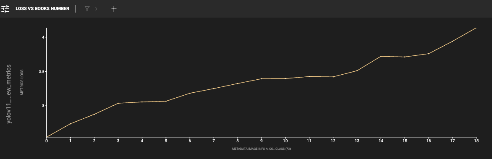<br/>
  <b>Figure 17</b> – Loss increases with number of books per sample
</div>


---

## ⚙️ Getting Started with Tensorleap

This quick start guide walks you through how to use the example repository.

### ✅ Prerequisites

- [Python 3.7+](https://www.python.org/)
- [Poetry](https://python-poetry.org/)
- [Tensorleap Account (Request Free Trial)](https://meetings.hubspot.com/esmus/free-trial)
- [Tensorleap CLI](https://github.com/tensorleap/leap-cli)

### 🔧 CLI Installation

```bash
curl -s https://raw.githubusercontent.com/tensorleap/leap-cli/master/install.sh | bash
