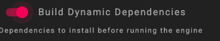
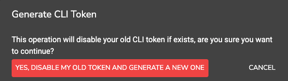

# 🚀 Object Detection Using YOLO — Step-by-Step Guide

This guide walks you through integrating YOLO models with Tensorleap for object detection, covering simple usage, pretrained alternatives, and custom-trained models.
### ✅ Current supported YOLO architectures

| Family  | Variants                                                                    |
|---------|-----------------------------------------------------------------------------|
| **YOLOv5-u** | `yolov5nu`&nbsp;•&nbsp;`yolov5su`&nbsp;•&nbsp;`yolov5mu`                    |
| **YOLOv8**   | `yolov8n`&nbsp;•&nbsp;`yolov8x`                                             |
| **YOLOv9**   | `yolov9t`&nbsp;•&nbsp;`yolov9s`&nbsp;•&nbsp;`yolov9m`&nbsp;•&nbsp;`yolov9c` |
| **YOLOv11**  | `yolo11n`&nbsp;•&nbsp;`yolo11s`&nbsp;•&nbsp;`yolo11m`&nbsp;•&nbsp;`yolo11x` |
| **YOLOv12**  | `yolo12n`&nbsp;•&nbsp;`yolo12s`&nbsp;•&nbsp;`yolo12m`&nbsp;•&nbsp;`yolo12l` |

First time users, follow [For First-Time Users: Configure Your Project](#for-first-time-users-configure-your-project) to configure your project's settings and environment first.

---

## 🔰 Case 1: Base Case: YOLOv11s with COCO128

Use this for the simplest setup with the default YOLOv11s model and the COCO128 dataset.

### Steps:

1. **Update Configuration**

   * Open `ultralytics/cfg/default.yaml`
   * Set the following:

     ```yaml
     tensorleap_path: <path_where_tensorleap_is_mounted> 
     ```

     This defines where the data and model files will be stored.

2. **Push Model to Tensorleap**

   ```bash
   leap projects push yolo11s.onnx
   ```

   * Downloads necessary files (model/data)
   * Initializes the Tensorleap project

---

## 🧠 Case 2: Using Other Pretrained YOLO Models

To use other pretrained YOLO variants from the [Ultralytics suite](https://docs.ultralytics.com/models/) without the need to have the model locally (it will be downloaded automatically from ultralytics github), follow these steps:

### Steps:

1. **Edit Configuration**

   * Open `ultralytics/cfg/default.yaml`
   * Update:

     ```yaml
     tensorleap_path: <your_tensorleap_mount_path>
     model: models/<desired_model_name>.pt
     ```

2. **Convert `.pt` to ONNX**

   ```bash
   python leap_custom_test.py
   ```
   (No changes are needed in the leap_custom_test.py file)   

This will:


   * Convert `.pt` to `.onnx`
   * Print the ONNX path (used in Step 3)
   * Generate `leap_mapping.yaml` file
   * Run a local sanity test on 10 samples
   * Download the coco dataset to <your_tensorleap_mount_path> if not present in this path
   
3. **Push to Tensorleap**

   ```bash
   leap projects push <path_to_your_model.onnx>
   ```

   Use the path printed from the previous step.

---

## 🧪 Case 3: Using Your Own Trained YOLO Model

If you’ve trained your own model and/or have custom datasets:

### Steps:

1. **Update Configuration**

   * Open `ultralytics/cfg/default.yaml`
   * Set:

     ```yaml
     tensorleap_path: <your_tensorleap_mount_path>
     model: models/<your_model_name>.pt
     ```
   * Place your `.pt` model in `<tensorleap_path>/models/`.
   * (Optional) Enable extra dataset support:

     ```yaml
     tensorleap_use_test: True
     tensorleap_use_unlabeled: True
     data: coco.yaml | coco128.yaml | coco8.yaml
     ```

2. **Model Conversion Options**

    Follow step A or B base on your needs:

   **A. If you *do not* have an ONNX model:**
      - Locate "leap_custom_test.py" script and set it's mapping_version value to your base yolo architecture name (e.x yolov11s)
      - run
      ```bash
      python leap_custom_test.py
      ```
   This will:

   -Converts `.pt` to `.onnx`

   -Prints <path_to_your_model.onnx> (will be used in step 3)

   -Generates `leap_mapping.yaml`

   -Runs local validation

   -**Download the coco dataset** to <your_tensorleap_mount_path> (if working with coco) if not already exists in this path . 

      **B. If you *already have* an ONNX/H5 model:**

      * Copy it to the root of the repo
      * Find the appropriate `leap_mapping.yaml` file for your YOLO architecture from:

       ```
       ultralytics/tensorleap_folder/mapping/
       ```
    * Copy it to the root and rename to `leap_mapping.yaml`


3. **Push to Tensorleap**

   ```bash
   leap projects push <path_to_your_model.onnx>
   ```
---

## ✅ Summary
| **Use Case**                | **Required Setup**                                     | **Preparation Step**      | **Supported Model Format(s)** |
| --------------------------- |--------------------------------------------------------| ------------------------- | ----------------------------- |
| **Base YOLOv11s + COCO128** | None                                                   | None                      | `onnx`                        |
| **Other Pretrained YOLOs**  | Specify model name in config (`default.yaml`)          | Run `leap_custom_test.py` | `onnx`                        |
| **Custom YOLO (Option A)**  | Place `.pt` model and edit dataset settings            | Run `leap_custom_test.py` | `onnx`                        |
| **Custom YOLO (Option B)**  | Provide `.onnx` or `.h5` model manually + find mapping | None                      | `onnx`, `h5`                  |

--- 


## For First-Time Users: Configure Your Project

Before running the project, make sure to configure it properly. Follow these steps:

1. **Tensorleap Settings**  
   On your local Tensorleap platform:
   - Open the menu (☰ hamburger icon) and go to **Settings**.
   - Ensure the **Build Dynamic Dependencies** toggle is switched **on**.

   

2. **Generate a New CLI Token**  
   - From the same menu (☰ hamburger icon), select **CLI Token**.
   - Generate a new token and **copy it** to use later in the CLI.

   

If you intend to use Cases 2 or 3b follow the next steps to configure your local poetry env.

---

## 🛠️ Setting Up the Virtual Environment (Poetry)

To get started using the existing `pyproject.toml` and `poetry.lock`, follow these steps:

### 1. Ensure Python 3.9.18 is Installed

Check if the required version is available:

```bash
pyenv versions
```

If not listed, install it:

```bash
pyenv install 3.9.18
```

Set it for the project:

```bash
pyenv local 3.9.18  # Use this version only for the current directory
```

> **Note:** You must have [pyenv](https://github.com/pyenv/pyenv) installed.

---

### 2. Install and Configure Poetry

If Poetry is not already installed:

```bash
pip install --user poetry
```

Verify the installation:

```bash
poetry --version
```

Point Poetry to the correct Python interpreter:

```bash
poetry env use $(pyenv which python)
```


### 3. Install Dependencies & Activate the Environment

With `pyproject.toml` and `poetry.lock` already present:

```bash
poetry install      # Installs all dependencies based on poetry.lock
poetry shell        # Activates the virtual environment
```

Check the active environment:

```bash
poetry env info
```

---

### 4. Verify Lock File Integrity

To ensure the lock file is correctly used and consistent:

```bash
poetry lock --no-update
poetry check
```

---


